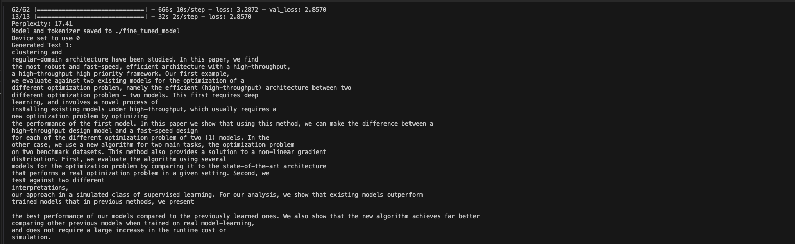

# Scientific Text Generation with Fine-tuned GPT-2 and RAG 🚀

> Fine-tuning DistilGPT-2 on scientific abstracts and implementing RAG for enhanced text generation

## 📋 Overview

This project demonstrates how to:
1. Fine-tune DistilGPT-2 on ML-ArXiv-Papers dataset (last two layers only)
2. Implement Retrieval-Augmented Generation (RAG) using the fine-tuned model

## 🛠️ Setup

### Prerequisites
- Python 3.9
- Anaconda/Miniconda

### Installation

```bash
# Clone the repository
git clone [your-repo-url]
cd [your-repo-name]

# Create and activate conda environment
conda env create -f environment.yml
conda activate tf_env

# Run fine-tuning
python3.9 FT.py

# Run RAG implementation
python3.9 RAG.py
```

## 🏗️ Project Structure

```
.
├── FT.py           # Fine-tuning script
├── RAG.py          # RAG implementation
├── environment.yml # Conda environment
└── README.md      # Documentation
```


### Fine-tuning Details
- **Base Model**: DistilGPT-2
- **Dataset**: [CShorten/ML-ArXiv-Papers](https://huggingface.co/datasets/CShorten/ML-ArXiv-Papers)
- **Approach**: Last two layers fine-tuning
- **Purpose**: Scientific text generation

## 📚 Usage

### Fine-tuning Process (FT.py)
```python
# Example usage of fine-tuning script
python3.9 FT.py
```


### RAG Implementation (RAG.py)
```python
# Example usage of RAG system
python3.9 RAG.py
```

### parameters
Since our testing is in local computer, we set the dataset size to 1000 to see whether the algorithm work or not. We can change the dataset size accordingly. Besides, in our code, only last two layers is tuning. You can change it also.

change the train_size, val_size in FT.py
```bash
    def load_and_process_data(
        self,
        dataset_name: str,
        train_size: int = 1000,
        val_size: int = 200
    ) -> Tuple[Dataset, Dataset]:
```

change the sample_size in RAG.py
```bash
    def load_data(self, sample_size: int = 1000) -> Dataset:
```

change the number of layers in FT.py
```bash
    def def setup_training(self) -> None:
    ...
        for layer in self.model.layers[:-2]:
            layer.trainable = False
    ...
```

## 📝 Citation

```bibtex
@dataset{CShorten_ML-ArXiv-Papers,
  author = {CShorten},
  title = {ML-ArXiv-Papers},
  year = {2024},
  publisher = {HuggingFace},
  url = {https://huggingface.co/datasets/CShorten/ML-ArXiv-Papers}
}
```

## ⭐ Show your support

Give a ⭐️ if this project helped you!
